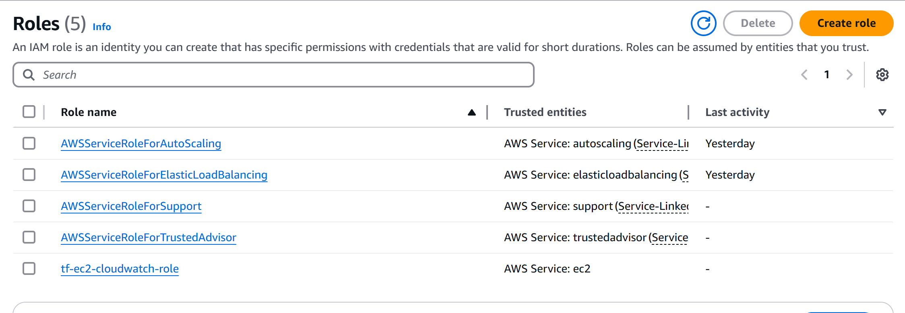
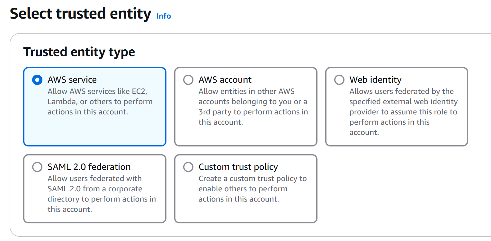
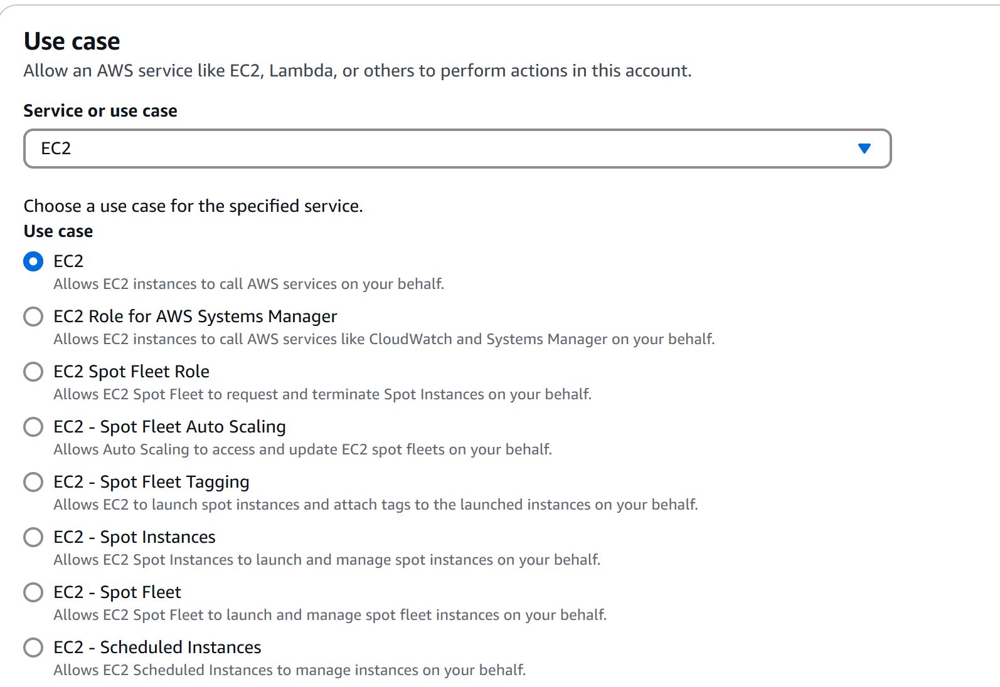
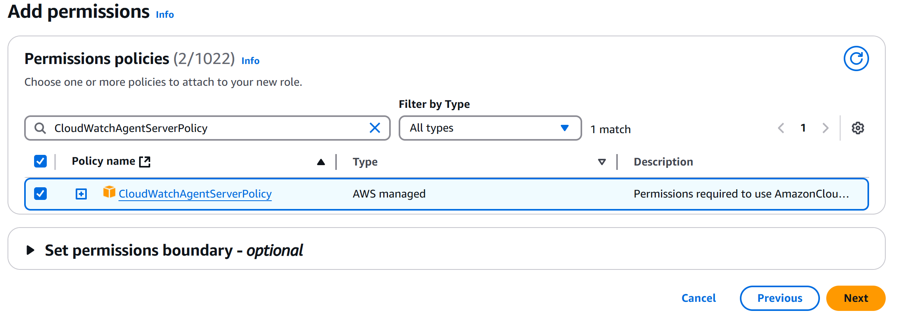
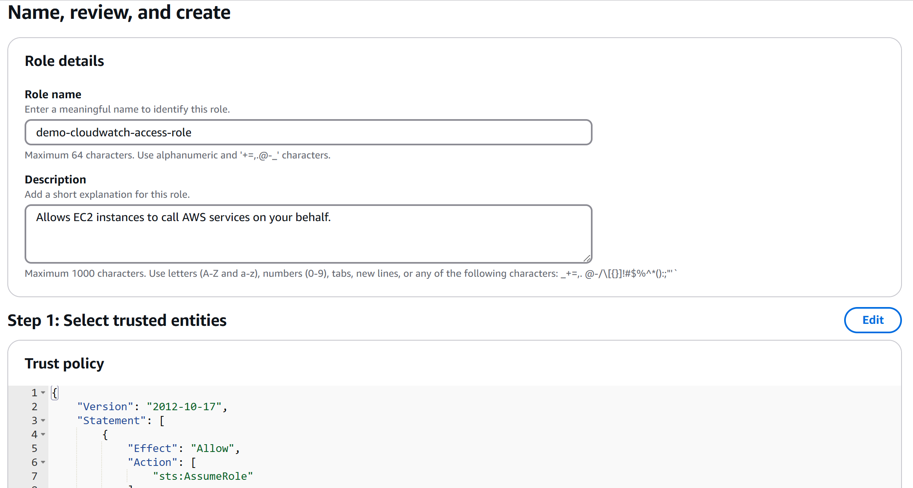
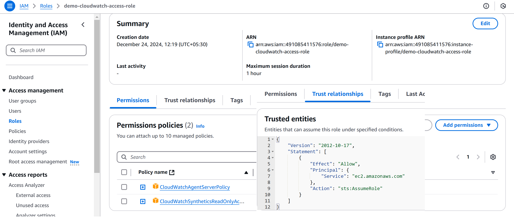

# Role Vs InstanceProfile?
There are two key parts of any authentication system, not just IAM:
- Who am I?
- What am I permitted to do?  - Role

Roles are designed to be “assumed” by other principals which do define “who am I?”, such as users, Amazon services, and EC2 instances.

An instance profile, on the other hand, defines “who am I?” **Just like an IAM user represents a person, an instance profile represents EC2 instances**. The only permissions an EC2 instance profile has is the power to assume a role.

### Relationship:
- An **Instance Profile** is essentially a mechanism to apply an IAM Role to an EC2 instance.
- The **IAM Role** defines the permissions, while the **Instance Profile** attaches this role to the instance.

### Example:
- **Role**: Define an IAM role that allows access to an S3 bucket.
- **Instance Profile**: Attach this role to an EC2 instance so that applications running on the instance can access the S3 bucket without embedding credentials.

> NOTE: An EC2 instance can have only one instance profile attached to it at a time.

---

## Instance profile vs AssumeRole:
- **AssumeRole**: Describes the behavior and characteristics of using AssumeRole
- **Instance Profile**: Describes the behavior and characteristics of using an instance profile for EC2.

| Feature                  | AssumeRole                                      | Instance Profile                                  |
|--------------------------|------------------------------------------------|--------------------------------------------------|
| **Purpose**              | Manually assume a role to get credentials      | Automatically assign a role to EC2              |
| **Use Case**             | Cross-account access, delegation               | Access AWS services from EC2 instances          |
| **Action**               | Requires `sts:AssumeRole` API call             | No explicit API call; uses IMDS                 |
| **Temporary Credentials**| Yes, obtained explicitly                       | Yes, provided automatically                     |
| **Principal Type**       | Any (user, service, role)                      | Only EC2 instances                              |
| **Security**             | Requires explicit trust and assumption         | Securely linked to EC2 metadata                 |

## Set up IAM Role for the EC2 Instance
To enable the CloudWatch agent to send data from the instance, you must attach an IAM role to the instance. The role to attach is `CloudWatchAgentServerRole`. You should have created this role previously.
1. Go to the IAM Management Console: Roles > Create role.
2. Select AWS service and choose EC2.
3. Attach the **CloudWatchAgentServerPolicy** managed policy
4. Name the role (e.g., `EC2CloudWatchLoggingRole`) and create it.
5. Attach the IAM role to your EC2 instance:
    - Go to the **EC2 Management Console** > Select your instance > **Actions** > **Security** > **Modify IAM role**.

After successfully created:

