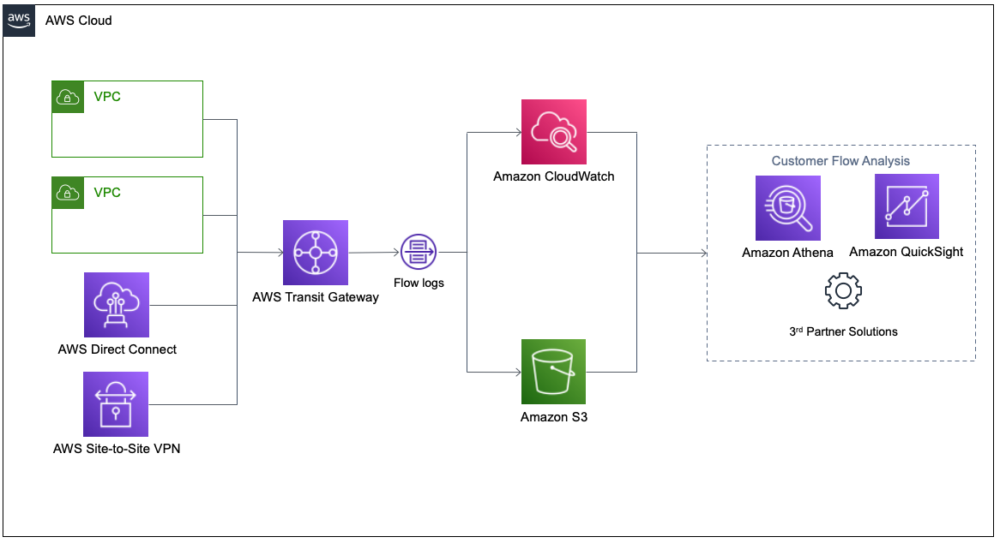

# AWS VPC Flow Logs
- [Mini Project - Learn how to use VPC Flow logs to diagnose network issues](https://youtu.be/4HvwQ1uoWEA?si=5M6xCmGNjT1zqhoQ)

[VPC Flow Logs](https://aws.amazon.com/blogs/networking-and-content-delivery/introducing-vpc-flow-logs-for-aws-transit-gateway/) is a feature that enables you to capture information about the IP traffic going to and from network interfaces in your VPC. Flow logs can help you with a number of tasks, such as:
- Monitoring the traffic that is reaching your instance
- Determining the direction of the traffic to and from the network interfaces
- Analyzing properties such as IP addresses, ports, protocol and total packets sent without the overhead of taking packet captures

### Flow logs can be created at three levels:
- **VPC Level**: Captures traffic for the entire VPC.
- **Subnet Level**: Captures traffic for a specific subnet.
- **Network Interface Level**: Captures traffic for a specific Elastic Network Interface (ENI).

Flow log data is collected outsides of the path of your network traffic, and therefore does not affect network throughput or latency. You can create or delete flow logs without any risk of impact to network performance.

This quickstart is a guide for ingestion AWS VPC Flowlogs into Snowflake. It demonstrates configuration of VPC flowlogs on AWS, ingestion using an external stage with Snowpipe and sample queries for CSPM and threat detection.

### Logged Information:
- Source and destination IP addresses.
- Ports.
- Protocols.
- Packet and byte counts.
- Action (accept/reject).
- Timestamp and other metadata.

### Storage Options:
- Logs can be sent to Amazon CloudWatch Logs or Amazon S3 for storage and analysis.

---

# Necessary Permissions for VPC Flow Log:
For VPC Flow Logs, the necessary permissions are:
1. **IAM Role for VPC Flow Logs:**
- Trust policy to allow `vpc-flow-logs.amazonaws.com` to assume the role.
- Permissions for `logs:CreateLogStream` and `logs:PutLogEvents` on the CloudWatch Log Group.

    ### Do we also need `AmazonSSMManagedInstanceCore` policy?
    The `AmazonSSMManagedInstanceCore` policy is **not required** for setting up VPC Flow Logs to CloudWatch.

    ### Why?
    The `AmazonSSMManagedInstanceCore` policy is used to enable Systems Manager features (e.g., Session Manager, Run Command) for EC2 instances, not for VPC Flow Logs.

- [AWS VPC Flow Logs: A Step-by-Step Tutorial - Part 21](https://youtu.be/2PQIDssp9ts?si=O8eHPzGzOhL94rwK)