# S3 Walkthrough

Object Details
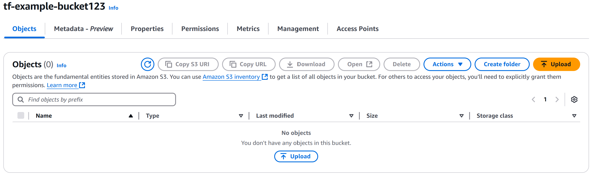
Metadata - Preview:
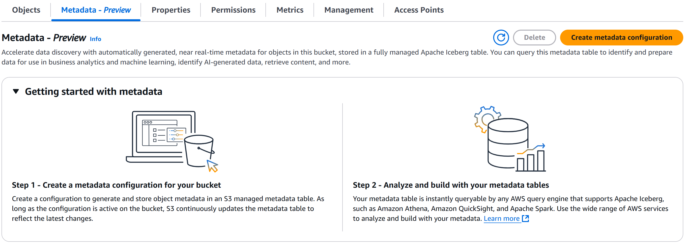
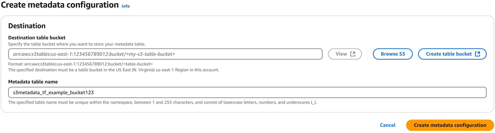

Properties:
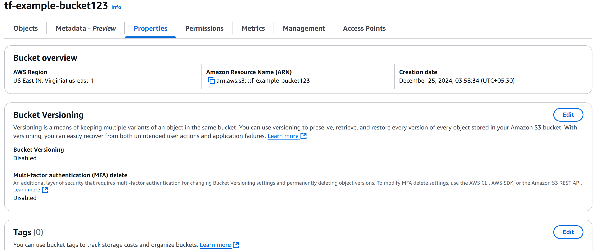
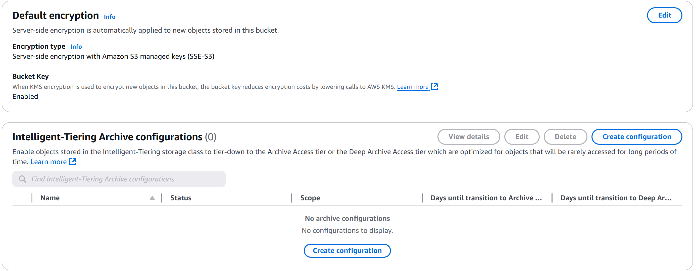
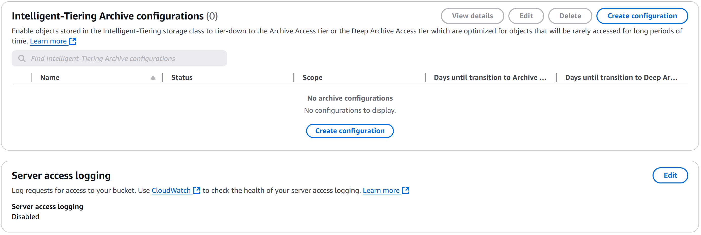
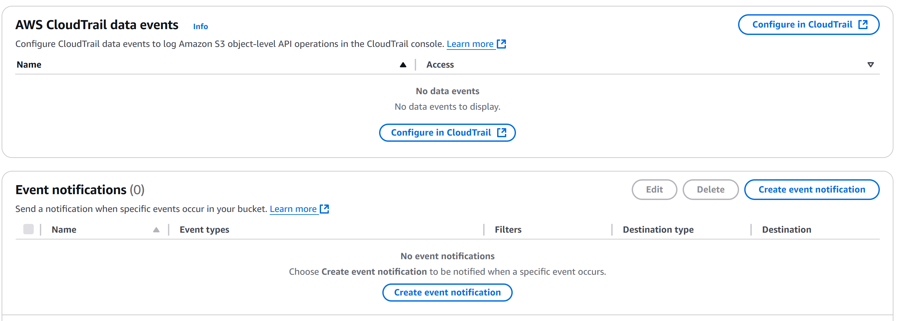
Event notifications:
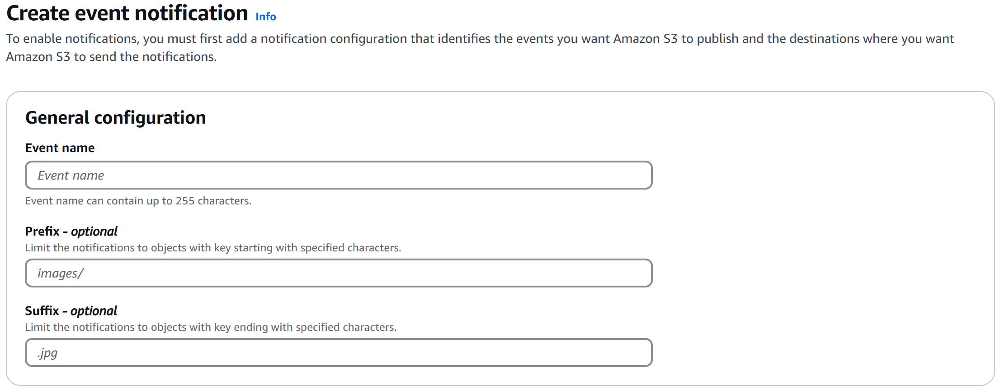
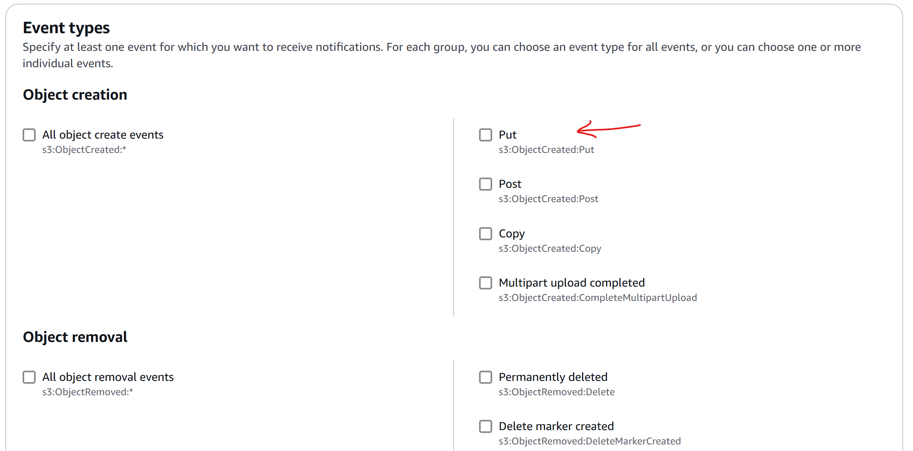
Destination (Lambda, SNS Topic, SQS)
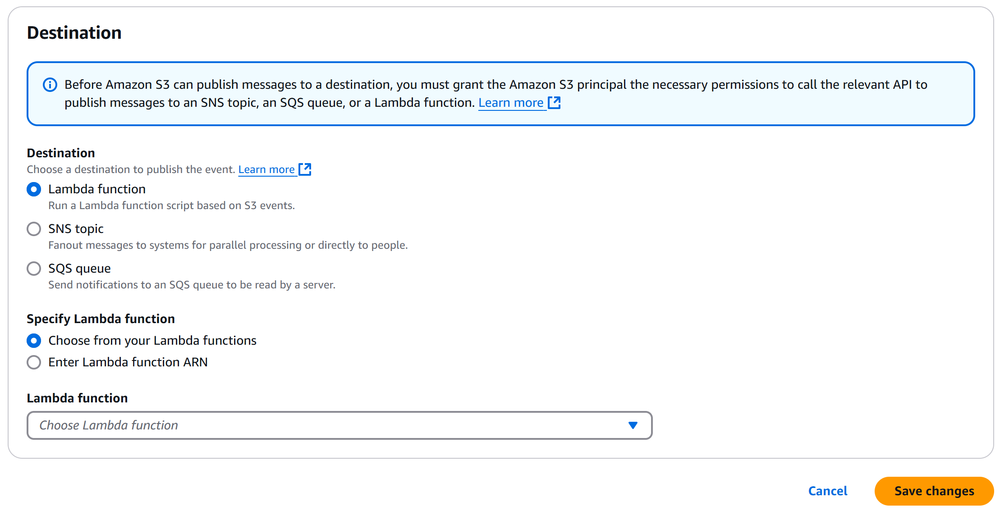

Amazon EventBridge: (S3 Events ---> EventBridge)
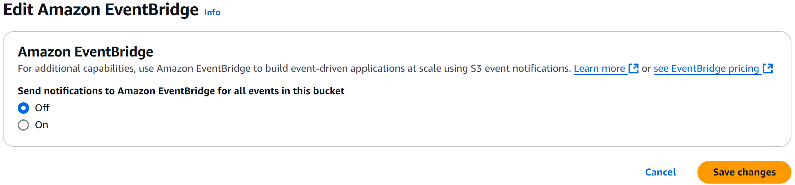

Transfer acceleration:
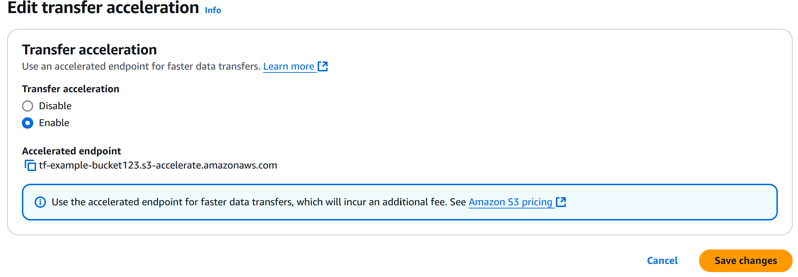

ObjectLock:
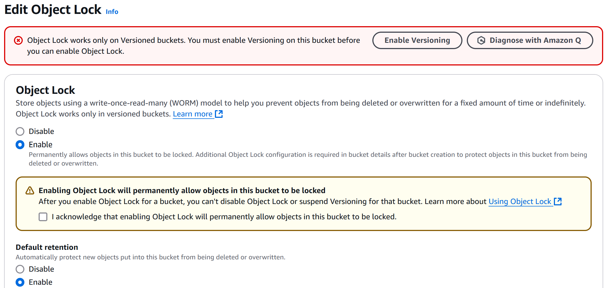
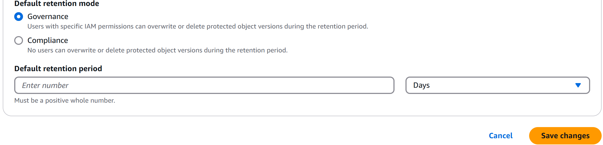

Static website hosting:
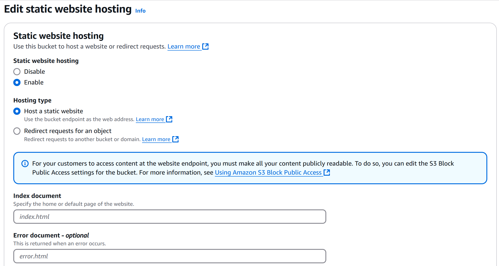
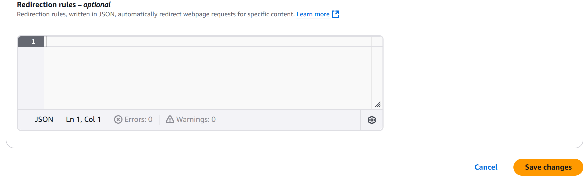