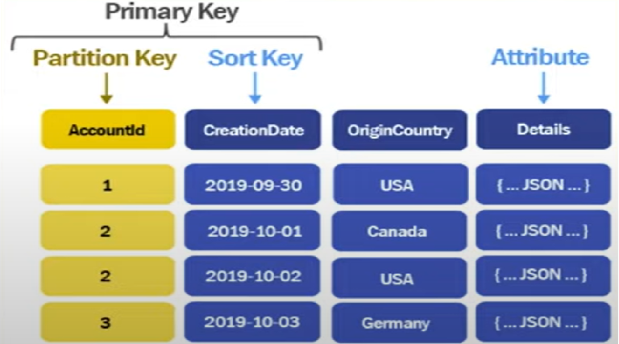

# Dynamo DB
- #### [Refer: DynamoDb using Terraform and AWS CLI](README-dynamodb_terraform.md)
- Partition Key
- Sort Key
- Table Class - Standard / Standard-IA
- Capacity calculator
- Read Capacity Unit
- Write Capacity Unit
- Global Table
- Indexes
  - Local Secondary Index
  - Global Secondary Index
- [Pricing](README-dynamodb_pricing.md)
- .....
- Data Modeling
- NoSQL Workbench
- DynamoDB Streams
- How DynamoDB internally store data


# Features of Amazon DynamoDB

| Feature                   | Description                                                                               |
|---------------------------|-------------------------------------------------------------------------------------------|
| **Scalability and Performance** | **On-demand and scaling** with single-digit millisecond response times.                   |
| **Key-Value and Document Store** | Flexible data model supporting key-value and document structures.                         |
| **Flexible Schema**       | No predefined schema; each item can have different attributes.                            |
| **Global Tables**         | **Multi-region replication with automatic conflict resolution**.                          |
| **Built-In Security**     | **Encryption at rest**, fine-grained IAM permissions, and VPC endpoint support.           |
| **High Availability**     | Multi-AZ replication ensures availability and durability.                                 |
| **Backup and Restore**    | On-demand backups and continuous backups with Point-in-Time Recovery (PITR).              |
| **Indexes**               | Global and Local Secondary Indexes for additional query patterns and alternate sort keys. |
| **DynamoDB Streams**      | Captures data modification events for triggers or event-driven architectures.             |
| **ACID Transactions**     | Supports atomic, consistent, isolated, and durable transactions.                          |
| **Time-to-Live (TTL)**    | Automatically deletes expired data to reduce storage costs.                               |
| **Querying and Filtering**| Query primary keys, sort keys, and use conditional writes or attribute filtering.         |
| **AWS Integration**       | Seamlessly integrates with AWS services like Lambda, S3, Glue, and CloudWatch.            |


# DynamoDB and SQL Concepts Comparison

| DynamoDB Concept                     | SQL Equivalent           | Example                                                                                          |
|--------------------------------------|--------------------------|--------------------------------------------------------------------------------------------------|
| **Table**                            | **Table**               | A DynamoDB table named `Users` is similar to an SQL table `Users` that holds user information.   |
| **Item**                             | **Row**                 | An item in the `Users` table (e.g., one user) corresponds to a row in the SQL `Users` table.     |
| **Attribute** <br/> (key-value pair) | **Column**              | An attribute like `UserID` or `Name` corresponds to columns in the SQL table.                   |
| **Partition Key**      | **Primary Key**        | The primary key uniquely identifies an item in a DynamoDB table. In SQL, it’s typically the primary key.    | DynamoDB: `UserID`<br>SQL: `UserID` (Primary Key)                                            |
| **Sort Key**           | **Index**              | A secondary part of a composite key in DynamoDB, allowing multiple items with the same partition key. SQL indexes enable faster query filtering. | DynamoDB: `Timestamp` (Sort Key)<br>SQL: `Timestamp` (Indexed column)                          |
| **Global Secondary Index (GSI)** | **Secondary Index**  | GSIs in DynamoDB allow queries on non-primary key attributes. SQL uses indexes to optimize query performance on other columns. | DynamoDB: GSI on `Email`<br>SQL: Index on `Email` column                                     |
| **Local Secondary Index (LSI)** | **Unique Index** | LSIs in DynamoDB allow alternate sorting of the data based on the partition key. SQL uses unique indexes for efficient querying. | DynamoDB: LSI on `LastName` (with same partition key)<br>SQL: Unique index on `LastName`     |


## Use Case: Order Management System
In an order management system, we can use the following attributes:
- **Partition Key**: `CustomerID` (since a customer can have multiple orders, it makes sense to partition by customer)
- **Sort Key**: `OrderID` (to uniquely identify each order for the customer)

### Example DynamoDB Table Structure:
**Table**: **Orders**

| **Partition Key** <br/>(CustomerID)    | **Sort Key** <br/>(OrderID) | Attributes                                                                           |
|----------------------------------------|-----------------------------|-----------------------------------------------------|
| C001                                   | O1001                       |{ "OrderDate": "2024-12-25", "TotalAmount": 250.00 } |
| C001                                   | O1002                       |{ "OrderDate": "2024-12-26", "TotalAmount": 150.00 } |
| C002                                   | O1003                       |{ "OrderDate": "2024-12-26", "TotalAmount": 300.00 } |
| C003                                   | O1004                       |{ "OrderDate": "2024-12-24", "TotalAmount": 400.00 } | 


## DynamoDB Schema:
````json
{
  "TableName": "Orders",
  "KeySchema": [
    { "AttributeName": "CustomerID", "KeyType": "HASH" },  // Partition Key
    { "AttributeName": "OrderID", "KeyType": "RANGE" }     // Sort Key
  ],
  "AttributeDefinitions": [
    { "AttributeName": "CustomerID", "AttributeType": "S" },
    { "AttributeName": "OrderID", "AttributeType": "S" }
  ],
  "ProvisionedThroughput": {
    "ReadCapacityUnits": 5,
    "WriteCapacityUnits": 5
  }
}
````

### How Partition Key and Sort Key Work:
1. **Partition Key** (`CustomerID`):
- This groups all the orders of a specific customer into the same partition. For example, all orders for `C001` (Customer 001) will be stored together.
2. **Sort Key** (`OrderID`):
- The sort key ensures that the orders for a particular customer are sorted by their unique `OrderID`. This allows you to easily query and retrieve orders for a customer in the order they were placed.

### Example Queries:
1. **Retrieve all orders for a customer** (`C001`):
   - Query: Retrieve all items where `CustomerID = 'C001'`, sorted by `OrderID` (ascending or descending).
   - Result:
        ````json
        [
          { "CustomerID": "C001", "OrderID": "O1001", "OrderDate": "2024-12-25", "TotalAmount": 250.00 },
          { "CustomerID": "C001", "OrderID": "O1002", "OrderDate": "2024-12-26", "TotalAmount": 150.00 }
        ]
        
        ````

2. Retrieve a specific order by customer (`C001`) and order ID (`O1001`):
    - Query: Retrieve the item where `CustomerID = 'C001'` and `OrderID = 'O1001'`.
    - Result:
         ````json
         { "CustomerID": "C001", "OrderID": "O1001", "OrderDate": "2024-12-25", "TotalAmount": 250.00 }
         
         ````


### AnotherExample 

