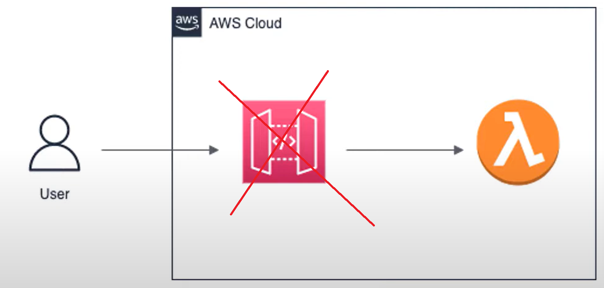
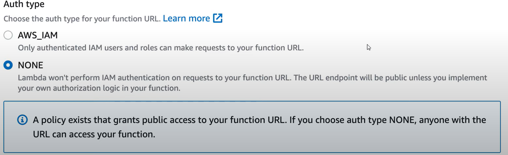

## Simplify Serverless Endpoints with AWS Lambda Function URLs

**https://<url-id>.lambda-url.<AWS_REGION>.on.aws**

An AWS Lambda function URL is a dedicated HTTP(S) endpoint that you can create for an AWS Lambda function. It allows you to invoke your Lambda function directly via an HTTP request, without needing to configure an API Gateway, Application Load Balancer (ALB), or any other intermediary service.



1. **Direct HTTP Access**: You can invoke the Lambda function using a simple HTTP request (GET, POST, PUT, DELETE, etc.).
2. **Authentication and Authorization**:
   - You can configure the URL to be publicly accessible or restricted using AWS Identity and Access Management (IAM) for authentication.
   - Optionally, you can enable AWS Lambda's built-in support for `resource-based policies` to control access.
3. **CORS Support**: You can configure Cross-Origin Resource Sharing (CORS) to allow or restrict access from specific domains.
4. **No Additional Cost**: Unlike API Gateway, there is no additional cost for using Lambda function URLs (you only pay for the Lambda execution).

````bash
aws lambda create-function-url-config \
    --function-name YOUR_FUNCTION_NAME \
    --auth-type AWS_IAM \
    --cors '{"AllowOrigins": ["*"], "AllowMethods": ["GET", "POST"]}'
````

or using Terraform

````hcl
# Create a Lambda function URL
resource "aws_lambda_function_url" "example_lambda_url" {
  function_name      = aws_lambda_function.example_lambda.function_name
  authorization_type = "NONE" # Use "AWS_IAM" for IAM-based authentication

  cors {
    allow_credentials = true
    allow_origins     = ["*"]
    allow_methods     = ["GET", "POST"]
    allow_headers     = ["Content-Type"]
    expose_headers    = ["Content-Type"]
    max_age           = 86400
  }
}

# Output the Lambda function URL
output "lambda_function_url" {
   value = aws_lambda_function_url.example_lambda_url.function_url
}
````

Example of Invoking a Lambda Function URL:
````bash
curl -X POST https://<your-function-url> \
     -H "Content-Type: application/json" \
     -d '{"key": "value"}'
````


## Security & Authentication 
**Auth Type parameter:**
- IAM
   ````json
   {
      "Version": "2012-10-17",
      "Statement": [
         {
            "StatementId": "FunctionURLAllowPublicAccess",
            "Effect": "Allow",
            "Principal": "< user or role or app or * >",
            "Action": "lambda:InvokeFunctionUrl",
            "Resource": "arn:aws:lambda:us-east-1:06700943:function:test"         
         }
      ]
   }
   ````
- NONE



## [Request and response payloads](https://docs.aws.amazon.com/lambda/latest/dg/urls-invocation.html#urls-payloads)
/api/items/{item_id}?parameter1=value1&parameter1=value2&parameter2=value
````json
{
  "version": "2.0",
  "routeKey": "$default",
  "rawPath": "/api/users",
  "rawQueryString": "parameter1=value1&parameter1=value2&parameter2=value",
  "cookies": [
    "cookie1",
    "cookie2"
  ],
  "headers": {
    "header1": "value1",
    "header2": "value1,value2"
  },
  "queryStringParameters": {
    "parameter1": "value1,value2",
    "parameter2": "value"
  },
  "requestContext": {
    "accountId": "123456789012",
    "apiId": "<urlid>",
    "authentication": null,
    "authorizer": {
        "iam": {
                "accessKey": "AKIA...",
                "accountId": "111122223333",
                "callerId": "AIDA...",
                "cognitoIdentity": null,
                "principalOrgId": null,
                "userArn": "arn:aws:iam::111122223333:user/example-user",
                "userId": "AIDA..."
        }
    },
    "domainName": "<url-id>.lambda-url.us-west-2.on.aws",
    "domainPrefix": "<url-id>",
    "http": {
      "method": "POST",
      "path": "/my/path",
      "protocol": "HTTP/1.1",
      "sourceIp": "123.123.123.123",
      "userAgent": "agent"
    },
    "requestId": "id",
    "routeKey": "$default",
    "stage": "$default",
    "time": "12/Mar/2020:19:03:58 +0000",
    "timeEpoch": 1583348638390
  },
  "body": "Hello from client!",
  "pathParameters": null,
  "isBase64Encoded": false,
  "stageVariables": null
}
````


## Request Throttling with Lambda URLs (429-Too Many Request)
- Not provided
- Implement Out of the box solution with Reserved Concurrency
