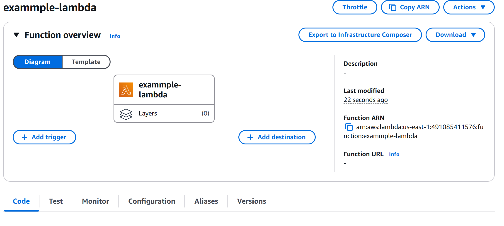
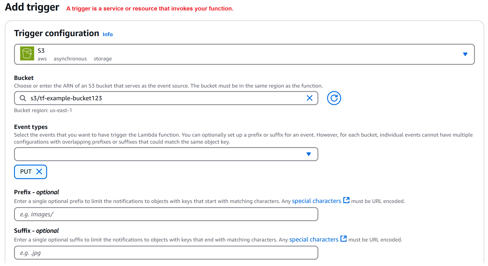
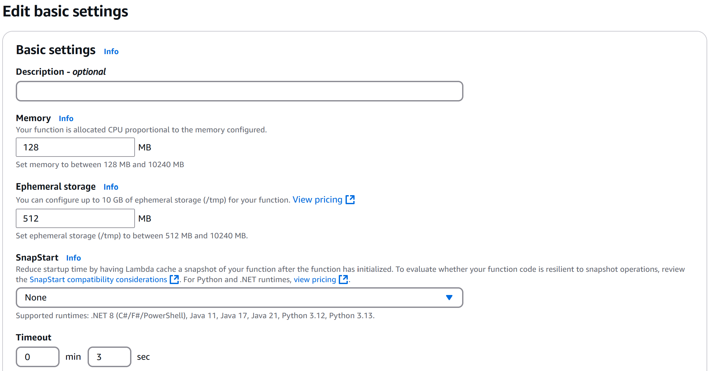

# AWSLambda Walkthrough

Once the Lambda creation is successful:

Configurations:

Trigger: (APIGW, ALB, CloudFront, COdeCommit, CloudWatchLog, EventBridge, S3, SNS, SQS, DynamoDB, Kinesis....)

### Permissions
Execution role:

**Resource-based policy statements**:  
Resource-based policies grant other AWS accounts and services permissions to access your Lambda resources.

### Destination:

Asynchronous invocation:
