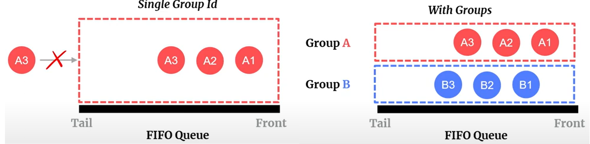

# FIFO Queue in AWS SQS

## Standard Vs FIFO Queue**
FIFO offers:
- **guaranteed in order processing**
- FIFO Queues prevent **duplicate messages**
- **De-duplication**:
  - **Content based hashing**: Messages with same content are discarded
  - **Message de-duplication-id**: messages with same provided **id** aed discarded
- **Grouping:**
  - Label messages with an ID ensures messages **with same ID** are always processed in order

    
  

## Limitation:
- **300** calls per seconds per api, **3,000** with **batching**
- Region dependent: **6000** calls per second per api. **60,000** with **batching**
- Autoscales partitions, but requires use of **message groups**
> **SNS -> SQS FIFO is not supported, must use SNS FIFO**