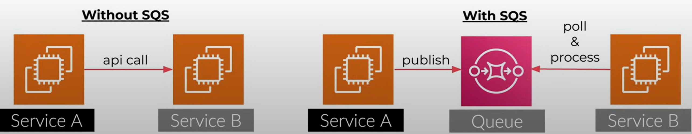
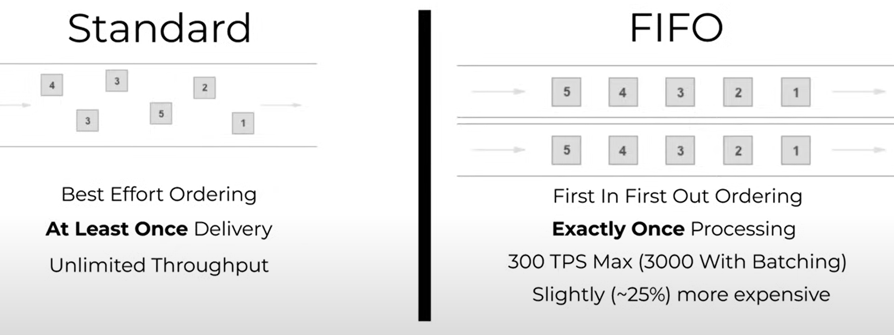

# SQS
- **Standard Vs [FIFO Queue](README-sqs_fifo.md)
- [BacBackpressure control](README-sqs_backpressure.md)
- Dead Letter Queue
- **Permissions**: 
  - CreateQueue, TagQueue, SetQueueAttributes
  - **Resource**: Resource = "arn:aws:sqs:us-east-1:*"

## Why use SQS over API call to other service?
- **Backpressure Control**: Consumers can choose the rate of processing
- **Fire and Forget**: Publishers have no insight into client processing
- **Eventual Guaranteed Processing**: Great for async or non-realtime apps
- **Application Decoupling**:  Decouples service dependencies

## Standard Vs FIFO Queue

## Common Patterns with SQS

## Important Details of SQS Queues:
- Many threads / processes can **poll** a Queue at once
- Only a single thread / process ca **process** a message at once
- **Long Polling** is supported and encouraged
- Support for **cross account** publishing / processing
- **256 KB** maximum payload size per message
- **Dead Letter Queues** (DLQ) can helps store failed messages for later processing