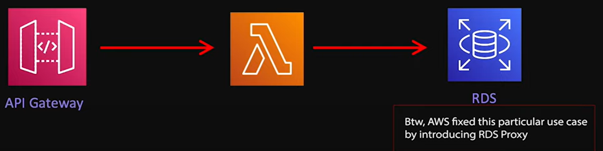
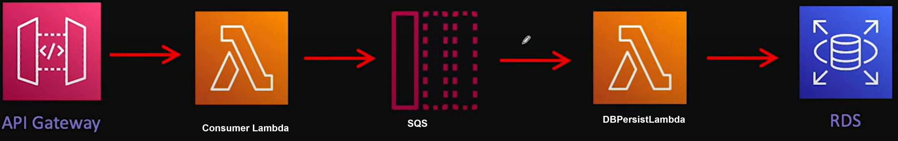

#  Lambda Function Best Practices
## 1. Build an Idempotent Lambda

## 2. Use Provisioned Concurrency - Fix cold start issues
- initializes a requested number of Lambdas, ready to serve requests
  
- Implement auto-scaling with Provision Concurrency also 
  - for example during day time 10 instances and 
  - during night 2 instances

## 3. Use Like-Scaling Infra with Lambda 
Use downstream system that have similar scaling behaviors and capacities t

In above diagram if API Gateway requesting 500 requests/second, then there will be 500 lambda invoke. **All 500 lambda will try to connection with RDS**. But the problem is we cant open these many connection on same time.   How should fix the above architecture?
- we can add a Queue (SQS) in middle

- Here we can implement Reserve Concurrency on DBPersistLambda (say 20 reserve concurrency. i.e., 20 simultaneous RDS connection)
- or we can use DynamoDB instead of RDS, as DynamoDB is serverless and it supports auto-scaling

## 4. Avoid SpringBoot
- Avoid SpringBoot Start-up times
- Avoid un-necessary libraries that spring boot adds

## 5. Avoid Lambda Chaining
Means calling one lambda from another
- Problems:
  - Cost
  - Error Handling
  - Tight Coupling
  - Scaling
- How to Avoid?
  - Step Function
  - SQS