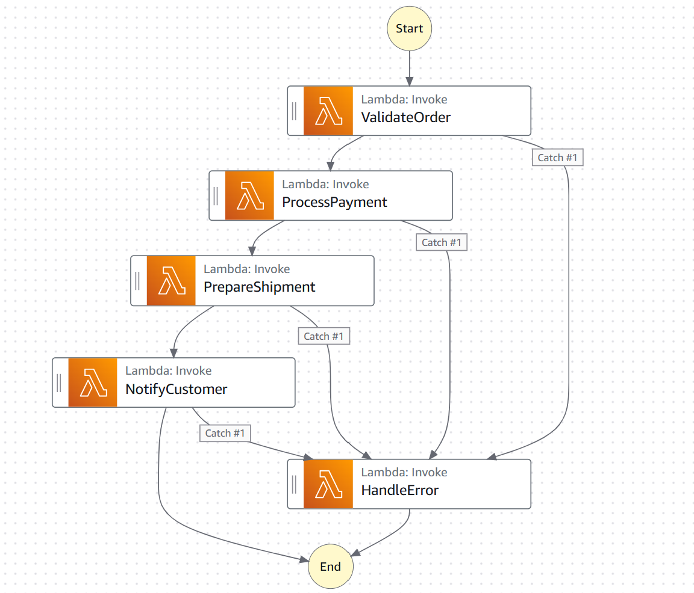

# Stepfunction
- [AWS Step Functions Crash Course | Step by Step Tutorial](https://youtu.be/jXxKRd_9nC0?si=_ogWY1HXfdUf9Wyd)

### Order Processing System

1. **Validate Order**: Validate the order details (e.g., check if the items are in stock, validate payment).
2. **Process Payment**: Charge the customer's payment method.
3. **Prepare Shipment**: Generate a shipping label and notify the warehouse.
4. **Notify Customer**: Send a confirmation email to the customer with the order details and tracking information.
5. **Handle Errors**: If any step fails, send a notification to the support team and log the error.


````hcl
provider "aws" {
  region = "us-east-1"  # Change to your preferred region
}

# IAM Role for Step Function
resource "aws_iam_role" "step_function_role" {
  name = "StepFunctionExecutionRole"

  assume_role_policy = jsonencode({
    Version = "2012-10-17"
    Statement = [
      {
        Action = "sts:AssumeRole"
        Effect = "Allow"
        Principal = {
          Service = "states.amazonaws.com"
        }
      }
    ]
  })
}

# IAM Policy for Step Function
resource "aws_iam_policy" "step_function_policy" {
  name        = "StepFunctionPolicy"
  description = "Policy for Step Function to invoke Lambda functions"

  policy = jsonencode({
    Version = "2012-10-17"
    Statement = [
      {
        Action = [
          "lambda:InvokeFunction"
        ]
        Effect   = "Allow"
        Resource = "*"
      }
    ]
  })
}

# Attach the Policy to the Role
resource "aws_iam_role_policy_attachment" "step_function_policy_attachment" {
  role       = aws_iam_role.step_function_role.name
  policy_arn = aws_iam_policy.step_function_policy.arn
}

# Lambda Function 1
resource "aws_lambda_function" "lambda_function_1" {
  filename      = "lambda_function_1.zip"
  function_name = "LambdaFunction1"
  role          = aws_iam_role.lambda_exec_role.arn
  handler       = "index.handler"
  runtime       = "nodejs14.x"

  source_code_hash = filebase64sha256("lambda_function_1.zip")
}

# Lambda Function 2
resource "aws_lambda_function" "lambda_function_2" {
  filename      = "lambda_function_2.zip"
  function_name = "LambdaFunction2"
  role          = aws_iam_role.lambda_exec_role.arn
  handler       = "index.handler"
  runtime       = "nodejs14.x"

  source_code_hash = filebase64sha256("lambda_function_2.zip")
}

# IAM Role for Lambda Execution
resource "aws_iam_role" "lambda_exec_role" {
  name = "LambdaExecutionRole"

  assume_role_policy = jsonencode({
    Version = "2012-10-17"
    Statement = [
      {
        Action = "sts:AssumeRole"
        Effect = "Allow"
        Principal = {
          Service = "lambda.amazonaws.com"
        }
      }
    ]
  })
}

# Step Function Definition
resource "aws_sfn_state_machine" "step_function" {
  name     = "MyStepFunction"
  role_arn = aws_iam_role.step_function_role.arn

  definition = <<EOF
{
  "Comment": "A simple AWS Step Function example",
  "StartAt": "InvokeLambda1",
  "States": {
    "InvokeLambda1": {
      "Type": "Task",
      "Resource": "${aws_lambda_function.lambda_function_1.arn}",
      "Next": "InvokeLambda2"
    },
    "InvokeLambda2": {
      "Type": "Task",
      "Resource": "${aws_lambda_function.lambda_function_2.arn}",
      "End": true
    }
  }
}
EOF
}
````
---

## Example Input for Step Function
````json
{
  "order_id": "12345",
  "items": [
    {
      "item_id": "item1",
      "quantity": 2
    },
    {
      "item_id": "item2",
      "quantity": 1
    }
  ],
  "amount": 100.50,
  "shipping_address": "123 Main St, Anytown, USA",
  "email": "customer@example.com"
}
````