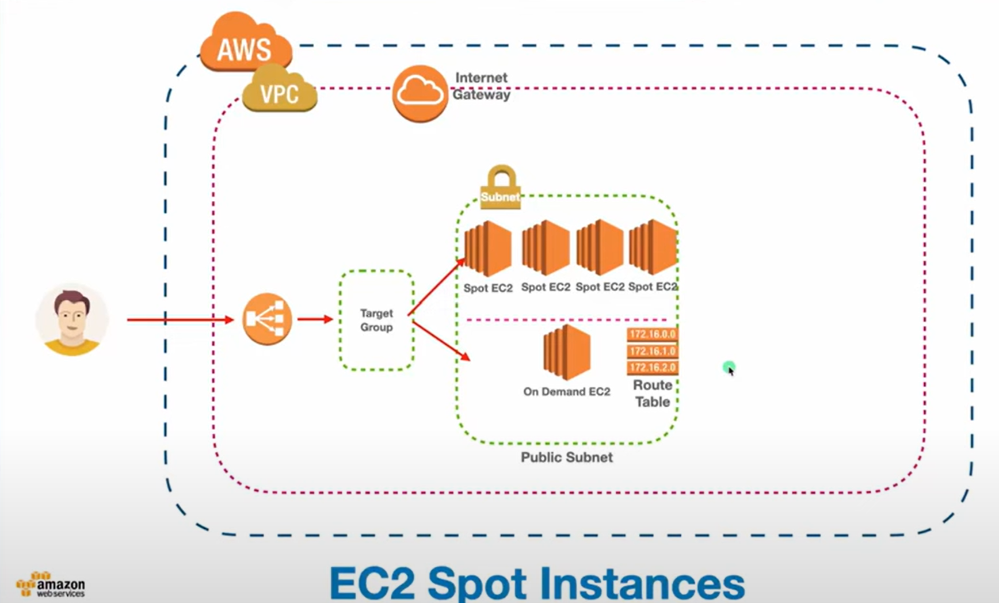

# EC2 Spot Instances + OnDemand EC2
EC2 Spot Instances allow you to use unused AWS compute capacity at significantly reduced costs (up to 90% cheaper than On-Demand prices). However, Spot Instances can be interrupted by AWS if the capacity is needed elsewhere, making them suitable for workloads that are `fault-tolerant` and `flexible`.



## Why we are using combination of Spot Instances along with On-Demand EC2?
- To provide maximum availability and 0 downtime of our services we can combine the spot instances with On-Demand Ec2 instances, so that our service never interrupted.

````hcl
# Spot Instance configuration
resource "aws_instance" "spot_instance" {
  ami                         = "ami-0b2f6494ff0b07a0e" # Replace with your desired AMI ID (e.g., Amazon Linux or Windows)
  instance_type               = "t2.micro" # Choose your instance type
  key_name                    = "my-key-pair" # Replace with your SSH key pair name
  security_groups             = [aws_security_group.ssh_sg.name]

  # Spot Instance configuration
  spot_price                  = "0.05" # Specify the maximum price you're willing to pay per hour (e.g., 0.05 USD)
  instance_interruption_behaviour = "terminate" # Action if the instance is interrupted
  wait_for_capacity_timeout    = "0"  # Don't wait for spot instance capacity

  # Tags
  tags = {
    Name = "Spot-Instance"
  }
}

output "spot_instance_public_ip" {
  value = aws_instance.spot_instance.public_ip
}
````


## Real-World Use Cases for Spot Instances
1. Batch Processing:
    - **Scenario:** Large-scale data processing tasks like rendering, video transcoding, or ETL pipelines that can tolerate interruptions.
    - **Example:** Processing a backlog of videos for a streaming service using Spot Instances to keep costs low.
2. CI/CD Pipelines (Build and Test)
    - **Scenario:** Running automated build, test, and deployment pipelines that involve short-lived compute tasks.
    - **Example:** Using Spot Instances to perform unit tests, integration tests, or container builds in Jenkins or GitLab.
3. Big Data and Analytics
    - **Scenario:** Running distributed processing frameworks like Apache Spark, Hadoop, or EMR for analytics workloads.
    - **Example:** Spot Instances can be used as worker nodes to process log files or analyze large datasets.
4. Machine Learning Training
5. Rendering and Simulations
6. Web Applications with Auto Scaling
   - **Scenario:** Low-priority, stateless workloads where you combine Spot Instances with On-Demand instances in an Auto Scaling Group (ASG).
   - **Example:** Running front-end servers for a seasonal or low-criticality application.


## Videos:
- [Master EC2 Spot Instances: Ultimate Guide to Massive Savings - Part 21](https://www.youtube.com/watch?v=b6oPVrDvV8E&list=PL7iMyoQPMtAPVSnMZOpptxGoPqwK1piC6&index=20)
- 
