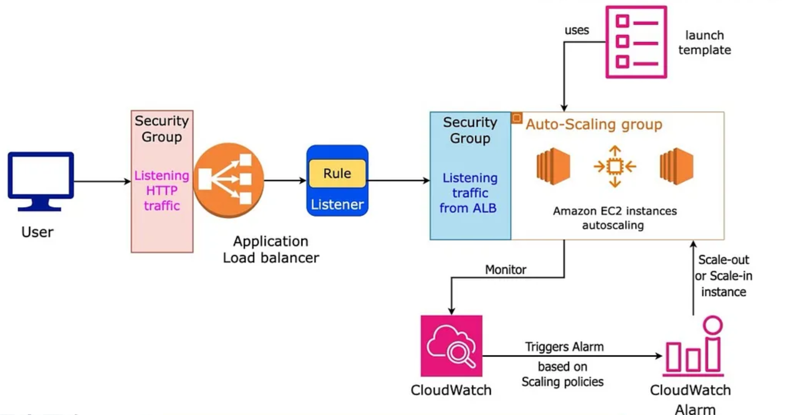

# Autoscaling Group
- [Setup AWS Application Load Balancer with Auto Scaling Group using Terraform](https://www.youtube.com/watch?v=1m54kzfjGtM)
- [AWS Autoscaling by Terraform](https://www.youtube.com/watch?v=9Z0heLHN2Xk)




## Steps:
1. VPC + Multi AZ + SG
2. Launch Template
3. ALB + TargetGroup
4. AutoScalingGroup (LaunchTemplate + Max/Min Size + TG)
   - Scale-up policy   (CPU Utilization > 30%)
   - Scale-down policy (CPU Utilization < 5%)
5. Cloudwatch Alarm & ELB HealthCheck
   - scale-up alarm (trigger above Scale-up policy when CPU Utilization > 30%)
   - scale-down alarm(trigger above Scale-down policy when CPU Utilization < 5%)


## EC2 Auto Scaling Group
````hcl
# 1. Launch Template
resource "aws_launch_template" "TF_LAUNCH_TEMPLATE" {
   name          = "tf-launch-template"
   image_id      = var.ami
   instance_type = "t2.micro"
   key_name      = var.key_name


   network_interfaces {
      security_groups             = [var.vpc.security_group.id]
      associate_public_ip_address = true
   }

   # user_data = filebase64("${path.module}/ec2-init.sh")
   user_data = base64encode(<<-EOF
    #!/bin/bash
    yum update -y
    yum install -y httpd
    echo "<h1>Host: $(hostname)</h1>" > /var/www/html/index.html
    systemctl start httpd
    systemctl enable httpd
  EOF
   )
}

# 2. ALB
resource "aws_lb" "TF_ALB" { 
   ....
}
resource "aws_lb_target_group" "TF_ALB" {
  ,...
}
resource "aws_lb_listener" "TF_ALB_HTTP_TCP_LISTENER" {
   ....
}

# 3.1. Auto Scaling Group
resource "aws_autoscaling_group" "TF_ASG" {
   name                 = "tf-${var.project}-asg"
   desired_capacity     = 2 # all time UP or RUN
   max_size             = 3
   min_size             = 1
   #health_check_grace_period = 300
   #health_check_type    = "ELB" # ["EC2", "ELB"]
   target_group_arns    = [aws_lb_target_group.TF_TG.arn]
   vpc_zone_identifier  = [var.vpc.public_subnets[*].id]
  
   launch_template {
      id      = aws_launch_template.TF_LAUNCH_TEMPLATE.id
      version = "$Latest"
   }

   enabled_metrics = [
     "GroupMinSize",
     "GroupMaxSize",
     "GroupDesiredCapacity",
     "GroupInServiceInstances",
     "GroupTotalInstances"
   ]

   metrics_granularity = "1Minute"
}

# 3.2. Scaling Policies
resource "aws_autoscaling_policy" "TF_scale_up" {
   name                   = "tf-${var.project}-asg-scale-up"
   autoscaling_group_name = aws_autoscaling_group.TF_ASG.name
   adjustment_type        = "ChangeInCapacity"
   scaling_adjustment     = 1 # increasing instance by 1
   cooldown               = 300
   policy_type            = "SimpleScaling"
}

resource "aws_autoscaling_policy" "TF_scale_down" {
   name                   = "tf-${var.project}-asg-scale-down"
   autoscaling_group_name = aws_autoscaling_group.TF_ASG.name
   adjustment_type        = "ChangeInCapacity"
   scaling_adjustment     = -1 # decreasing instance by 1
   cooldown               = 300
   policy_type            = "SimpleScaling"
}

# 3.3. Cloudwatch ALarms
# alarm will trigger the ASG policy (scale/down) based on the metric (CPUUtilization), comparison
resource "aws_cloudwatch_metric_alarm" "TF_SCALE_UP_ALARM" {
   alarm_name          = "tf-${var.project}-asg-scale-up-alarm"
   alarm_description   = "asg-scale-up-cpu-alarm"
   comparison_operator = "GreaterThanOrEqualToThreshold"
   evaluation_periods  = 2
   metric_name         = "CPUUtilization"
   namespace           = "AWS/EC2"
   period              = 120
   statistic           = "Average"
   threshold           = 30 # new instance will be created once CPU utilization is higher than 30
   dimensions          = {
      "AutoScalingGroupName" = aws_autoscaling_group.TF_ASG.name
   }
   actions_enabled     = true
   alarm_actions       = [aws_autoscaling_policy.TF_scale_up.arn]
}

# scale down alarm
resource "aws_cloudwatch_metric_alarm" "TF_SCALE_DOWN_ALARM" {
   alarm_name          = "tf-${var.project}-asg-scale-down-alarm"
   alarm_description   = "asg-scale-down-cpu-alarm"
   comparison_operator = "LessThanOrEqualToThreshold"
   evaluation_periods  = 2
   metric_name         = "CPUUtilization"
   namespace           = "AWS/EC2"
   period              = 120
   statistic           = "Average"
   threshold           = 5 # No instance will be scale down when CPU utilization is lowe than 5%
   dimensions          = {
      "AutoScalingGroupName" = aws_autoscaling_group.TF_ASG.name
   }
   actions_enabled     = true
   alarm_actions       = [aws_autoscaling_policy.TF_scale_down.arn]
}
````
**Scaling Policies:** The `scale_up` and `scale_down` policies adjust the ASG capacity. You can customize scaling triggers by adding AWS CloudWatch alarms.

