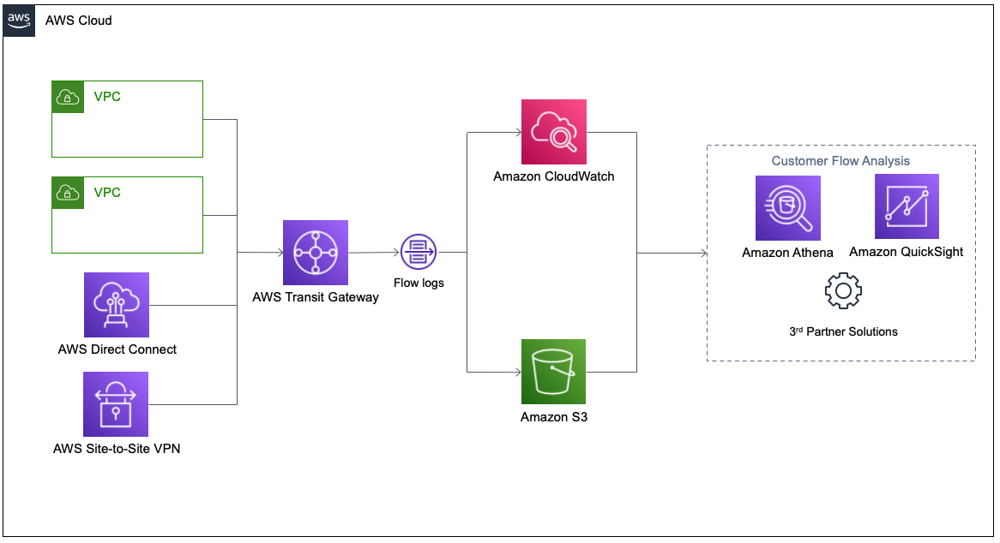
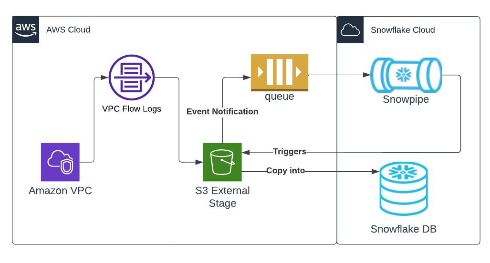

# AWS VPC Flow Logs
[VPC Flow Logs](https://aws.amazon.com/blogs/networking-and-content-delivery/introducing-vpc-flow-logs-for-aws-transit-gateway/) is a feature that enables you to capture information about the IP traffic going to and from network interfaces in your VPC. Flow logs can help you with a number of tasks, such as:
- Monitoring the traffic that is reaching your instance
- Determining the direction of the traffic to and from the network interfaces
- Analyzing properties such as IP addresses, ports, protocol and total packets sent without the overhead of taking packet captures

Flow log data is collected outside of the path of your network traffic, and therefore does not affect network throughput or latency. You can create or delete flow logs without any risk of impact to network performance.

This quickstart is a guide for ingestion AWS VPC Flowlogs into Snowflake. It demonstrates configuration of VPC flowlogs on AWS, ingestion using an external stage with Snowpipe and sample queries for CSPM and threat detection.

### Prerequisites:
- AWS user with permission to create and manage IAM policies and roles

- [AWS VPC Flow Logs: A Step-by-Step Tutorial - Part 21](https://youtu.be/2PQIDssp9ts?si=O8eHPzGzOhL94rwK)