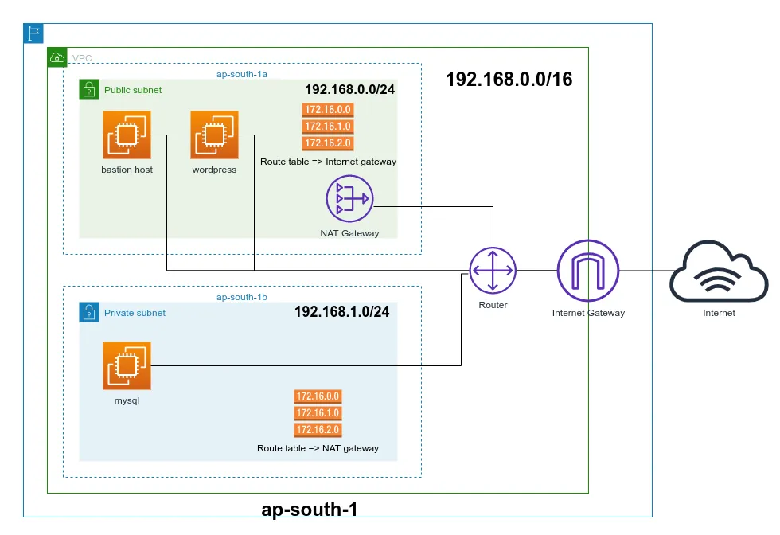
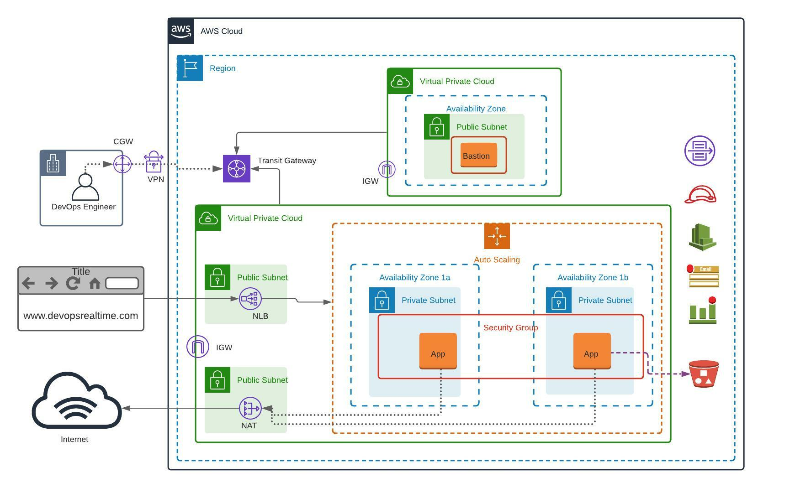

https://medium.com/geekculture/how-to-manage-public-and-private-subnets-in-aws-with-terraform-69c272003c81

## FAQs
1. **Can we create multiple VPC in an availability zone?**
  - Yes, A VPC spans an entire AWS Region, which contains multiple Availability Zones.
  - You can create multiple VPCs in the same region, and their subnets can be placed in the same or different AZs within that region.
  - **Subnets are AZ-Specific:**
    - Subnets in a VPC must be created in a specific AZ.
  - **Use Cases for Multiple VPCs in the Same AZ:**
    - **Multi-Tenant Architecture:** Isolate workloads for different customers or environments (e.g., dev, test, prod).
    - **High Availability Design;** Distribute workloads across multiple VPCs and AZs for fault tolerance.
  - **Example Scenario:**
    - VPC 1: `10.0.0.0/16` with a subnet in `us-east-1a`.
    - VPC 2: `192.168.0.0/16` with a subnet also in `us-east-1a`.
2. **Why we need route table if we have IGW?**
   - The route table tells the VPC to send internet-bound traffic (e.g., `0.0.0.0/0`) to the IGW.
   - Without a route table entry, the traffic will not know where to go, and the IGW cannot function.
   - **Scenario:**
     - VPC CIDR: `10.0.0.0/16`
     - Public Subnet CIDR: `10.0.1.0/24`
     - Private Subnet CIDR: `10.0.2.0/24`
     - Internet Gateway (IGW): `igw-abc123`
     - NAT Gateway (for private subnet): `nat-xyz789`   
   - Route Table for the Public Subnet`(10.0.1.0/24)`:
    
    | Destination  | Target | Description |
    | ------------- | ------------- |------------- |
    | 10.0.0.0/16 | local   | Enables communication within the VPC.   |
    | 0.0.0.0/0 | igw-abc123   | Routes internet-bound traffic to the IGW.   |
    - Route Table for the private Subnet`(10.0.2.0/24)`:

   | Destination  | Target | Description |
       | ------------- | ------------- |------------- |
   | 10.0.0.0/16 | local   | Enables communication within the VPC.   |
   | 0.0.0.0/0 | nat-xyz789   | Routes internet-bound traffic to the NAT Gateway.   |
3. where does rote table data are stored? 
   - managed servide by AWS
4. which Ip will be shown by customer on internet? should it be internet gateway IP ? No, IGW itself does not have an IP address,---it simply routes traffic between the instance and the internet.
5. can t we merge these 2 route table into one? No
6. Why a NAT Gateway is Placed in a Public Subnet?
   - **A NAT Gateway must be created in a public subnet** because it relies on access to the Internet Gateway to facilitate internet-bound traffic for private subnet resources.
   - **Outbound Internet Access:** 
     - A NAT Gateway needs to route traffic from private subnet instances to the internet.
     - To do this, the NAT Gateway must have access to the Internet Gateway (IGW), which is only accessible from public subnets.
   - **Traffic Flow:**
     - Private subnet instances route their internet-bound traffic to the NAT Gateway.
     - The NAT Gateway translates the private IPs to its public Elastic IP and sends the traffic to the internet via the IGW.
   - **Why Not in a Private Subnet?**
     - It wouldn’t have direct access to the IGW (since private subnets do not route to the IGW).
     - The NAT Gateway itself needs internet access to perform network address translation for private instances.
7. asasa
