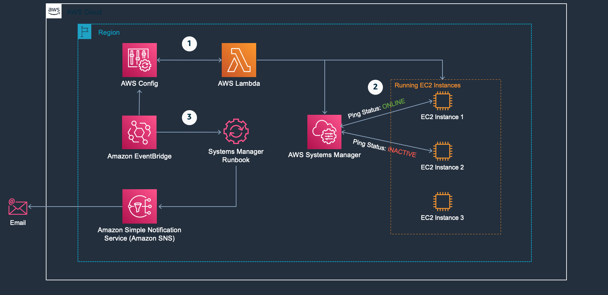

# AWS Systems Manager (SSM)
SSM which you can use to view and control your infrastructure and allows its users to run remote commands without the need for SSH,

you can view operational data from multiple AWS services and automate operational tasks across your AWS resources. It helps you maintain security and compliance by scanning your managed nodes (A managed node is any machine configured for Systems Manager) and reporting on any policy violations it detects.

[//]: # ([![Watch the video]&#40;ssm_1.png&#41;]&#40;https://youtu.be/UmMBu_k_5OQ?si=s6fP2_6utoeeBbmt&#41;)

[Download Video](../diagrams/ssm.mp4)

## [Improve monitoring of AWS Systems Manager Agent](https://aws.amazon.com/blogs/mt/improve-monitoring-of-aws-systems-manager-agent/)

1. AWS Config runs a Lambda function every hour that checks running EC2 instances against the fleet of instances in Systems Manager. You can adjust the frequency of the AWS Config rule between 1 and 24 hours, which will also adjust frequency the Lambda function is invoked.
2. If a running instance does not appear in Systems Manager or has a ping status other than online, the instance is reported as noncompliant to AWS Config.
3. Any noncompliant instance triggers an event in EventBridge that invokes a [Systems Manager runbook](https://docs.aws.amazon.com/systems-manager/latest/userguide/automation-documents.html) that sends an email notification. You’ll use EventBridge to format the email notification.

## [Secrets Manager vs Parameter Store: Which Should You Use?](https://youtu.be/ULU2cRQI4hY?si=MBrqYx4rJ2WzghSA)
## [Mini Project - Learn how to use AWS Systems Manager](https://youtu.be/B2MecqC5nJA?si=buugYpQevpDq-M8p)
