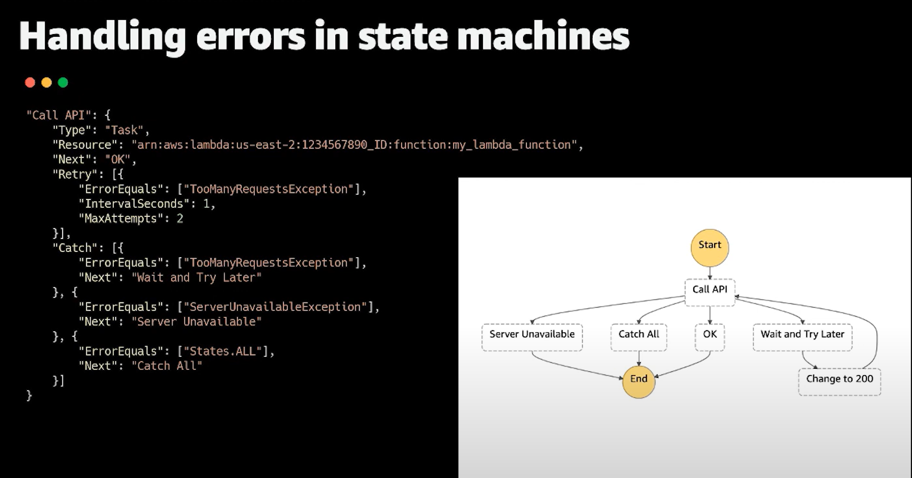

## AWS Practical Labs

1. [AWS CDK in Java for Beginners](https://www.youtube.com/watch?v=R7wSTZ54gNk&list=PLLv1Hn1N3bRxgxEX1AIJn8GK_6q_C-FC8)
2. [S3 to SQS Trigger - Trigger](https://www.youtube.com/watch?v=XNO0h61WmzE)
2.
3. [AWS Lambda SQS Integration](https://www.youtube.com/watch?v=L8criflLR20)

## VPC
- [Mini Project - Learn how to use VPC Flow logs to diagnose network issues](https://www.youtube.com/watch?v=4HvwQ1uoWEA&list=PLTk5ZYSbd9MiiBmPitRUGWIgnq9nm--GZ&index=9)

## API Gateway
- [How To Add Throttling to API Gateway HTTP API ](https://youtu.be/sCXejDwPGY4?si=RenRHvAurjlRE1_t)

## CloudWatch
- [How To Create a CloudWatch Dashboard](https://youtu.be/5QK3FB1EsV0?si=I2We1NFD8zdO0kzl)
- [Stream Your Cloudwatch Logs LIVE with Cloudwatch Live Tail](https://youtu.be/JYmwEfLioG8?si=6qGqMU-NA32bZZUK)

## Lambda
- [AWS Lambda Error handling](https://www.youtube.com/watch?v=CiRs3wA1BXM&list=PLLv1Hn1N3bRzke3cYLX_yl9CEEr0J0bf7&index=3)
- [AWS Lambda Powertools](https://youtu.be/dH2GP6Lydj8?si=bZ66y9VmelawL3sm)
- IDEMPOTENCY on AWS Lambda
- [Optimizing the Serverless Architecture with Circuit breaker & Idempotent patterns](https://youtu.be/vzoYAGQUSyw?si=wHW-LZxH5RYNp6ic)
- X-Ray - Traces
- [DLQ-Lambda Error Handling for Async Events](https://www.youtube.com/watch?v=EB2OWQhWhIs&list=PLLv1Hn1N3bRzke3cYLX_yl9CEEr0J0bf7&index=4)
- [Trigger Lambda -> SNS](https://www.youtube.com/watch?v=Jh_jrcOpF-I&list=PLLv1Hn1N3bRzke3cYLX_yl9CEEr0J0bf7&index=9)
- [Mini Project - Using Lambda and AWS X-Ray to debug ( serverless ) applications](https://www.youtube.com/watch?v=V1Fj8uEyp-E&list=PLTk5ZYSbd9MiiBmPitRUGWIgnq9nm--GZ&index=10)
- Trigger Lambda -> SQS
- SQS --> DynamoDB
- [What is Lambda Throttling? (and how to fix it!)](https://youtu.be/2tmsyweB3k4?si=0Zi2VZOKEttlWCNq)
- 
- [S3 Put Object ---> Invoke Lambda](https://www.youtube.com/watch?v=3oV4Nj_ruOA&list=PLLv1Hn1N3bRzke3cYLX_yl9CEEr0J0bf7&index=2)
- SQS ---> Lambda using EventSourceMapping
- [AWS Lambda Function URLs Demo ](https://www.youtube.com/watch?v=zAMPNV6F2cI&list=PLLv1Hn1N3bRzke3cYLX_yl9CEEr0J0bf7&index=7)
- [Schedule AWS Lambda Functions Using EventBridge](https://www.youtube.com/watch?v=-ResiAcM8pg&list=PLLv1Hn1N3bRzke3cYLX_yl9CEEr0J0bf7&index=8)

## DynamoDB
- [DynamoDB under the hood - How does it works](https://youtu.be/ZhXqNcbR4n0?si=CLLlMGM6U_Qwh9xq)
- [DynamoDB GetItem vs Query API](https://youtu.be/twxM7WTfhGs?si=LMQ2nVmmex4XJEhI)
- [Load, Save, Query, Delete, with DynamoDB Mapper](https://www.youtube.com/watch?v=m61Uo_PGwVc)
- [Mini Project - Implement DynamoDB Triggers using Streams and Lambda](https://www.youtube.com/watch?v=WgqdkaTaC4M&list=PLTk5ZYSbd9MiiBmPitRUGWIgnq9nm--GZ&index=1)
- [DynamoDB Mapper ](https://youtu.be/m61Uo_PGwVc?si=8lySByKDAvdC_lE4)

## Code Pipeline
-  [Mini Project - Build a full Deployment pipeline using CodeCommit, Code Deploy and Code Pipeline](https://www.youtube.com/watch?v=MDMH_XXDbrI&list=PLTk5ZYSbd9MjkP6-x8sbJ00wJyyhzk0oi&index=2)

## Authentication 
- [Mini Project - Implementing a Simple Web Identity Federation Application](https://www.youtube.com/watch?v=sYurFodsnlM&list=PLTk5ZYSbd9MjkP6-x8sbJ00wJyyhzk0oi&index=5)

## CloudFront
- [Mini Project - Performance and Networking - EC2/Global Accelerator/ CloudFront](https://www.youtube.com/watch?v=EOH-ukz9FD4&list=PLTk5ZYSbd9MiiBmPitRUGWIgnq9nm--GZ&index=3)

## S3
- [Mini Project - Learn how to Implement S3 Multi-Region Access points](https://www.youtube.com/watch?v=UUleX4pXLVo&list=PLTk5ZYSbd9MiiBmPitRUGWIgnq9nm--GZ&index=6)

## System Manager
- [Mini Project - Learn how to use AWS Systems Manager](https://www.youtube.com/watch?v=B2MecqC5nJA&list=PLTk5ZYSbd9MiiBmPitRUGWIgnq9nm--GZ&index=8)
- [Secrets Manager vs Parameter Store: Which Should You Use?](https://youtu.be/ULU2cRQI4hY?si=vw2O3_-tEUPixaqf)

## Event Bridge
- [Amazon EventBridge Deep Dive Series | Lab1: Create Event bus, Rule & Test](https://www.youtube.com/watch?v=y9Xzi6KyRrc&list=PL8lTMiBX0pTYLkAwsx-n3g_xWAM3Kx-Ga&index=13)
- [Amazon EventBridge Deep Dive Series | Lab2 EventBridge Rule for API Destination](https://www.youtube.com/watch?v=xsT0XDOwx9M&list=PL8lTMiBX0pTYLkAwsx-n3g_xWAM3Kx-Ga&index=12)
- [Amazon EventBridge Deep Dive Series | Lab3: EventBridge Rule for Step Function](https://www.youtube.com/watch?v=M41Axyas5pk&list=PL8lTMiBX0pTYLkAwsx-n3g_xWAM3Kx-Ga&index=11)
- [Amazon EventBridge Deep Dive Series | Lab4 EventBridge Rule for SNS SQS](https://www.youtube.com/watch?v=fq4L2vXJhfw&list=PL8lTMiBX0pTYLkAwsx-n3g_xWAM3Kx-Ga&index=10)
- [Amazon EventBridge Deep Dive Series | Lab5 EventBridge Schedule](https://www.youtube.com/watch?v=f7iuK1IRfhI&list=PL8lTMiBX0pTYLkAwsx-n3g_xWAM3Kx-Ga&index=9)
- [Amazon EventBridge Deep Dive Series | Lab6 EventBridge Schema Registry](https://www.youtube.com/watch?v=rDONGca1hGo&list=PL8lTMiBX0pTYLkAwsx-n3g_xWAM3Kx-Ga&index=8)
- [Amazon EventBridge Deep Dive Series | Lab7 Events Archive and Replay](https://www.youtube.com/watch?v=7swbqPIZxY4&list=PL8lTMiBX0pTYLkAwsx-n3g_xWAM3Kx-Ga&index=7)
- [Amazon EventBridge Deep Dive Series | Lab9 EventBridge Rule – Lambda Destination](https://www.youtube.com/watch?v=RNN9wHpXcg8&list=PL8lTMiBX0pTYLkAwsx-n3g_xWAM3Kx-Ga&index=6)
- [Amazon EventBridge Deep Dive Series | Lab10 EventBridge Rule – Lambda Error Handling](https://www.youtube.com/watch?v=jbjv-Sq4N64&list=PL8lTMiBX0pTYLkAwsx-n3g_xWAM3Kx-Ga&index=5)
- [Amazon EventBridge Deep Dive Series | Lab11 SNS Pub Sub Architecture with SQS](https://www.youtube.com/watch?v=zYKstzbMGaY&list=PL8lTMiBX0pTYLkAwsx-n3g_xWAM3Kx-Ga&index=4)
- [Amazon EventBridge Deep Dive Series | Lab12 SNS Pub Sub –Message Filtering](https://www.youtube.com/watch?v=kyWbdImD52A&list=PL8lTMiBX0pTYLkAwsx-n3g_xWAM3Kx-Ga&index=3)
- [Amazon EventBridge Deep Dive Series | Lab13 SNS Pub Sub – Advanced Message Filtering](https://www.youtube.com/watch?v=Sue2XRvJ2QQ&list=PL8lTMiBX0pTYLkAwsx-n3g_xWAM3Kx-Ga&index=2)
- [Amazon EventBridge Deep Dive Series | Lab14 SNS Pub Sub Error Handling](https://www.youtube.com/watch?v=XJyFnf5jq_s&list=PL8lTMiBX0pTYLkAwsx-n3g_xWAM3Kx-Ga&index=1)
- 

